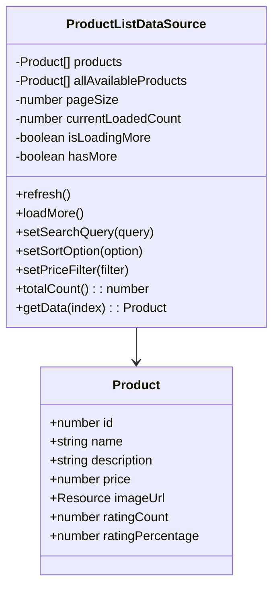
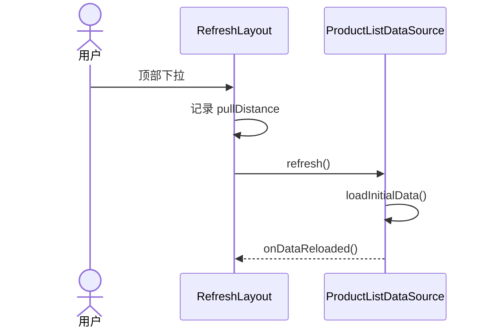
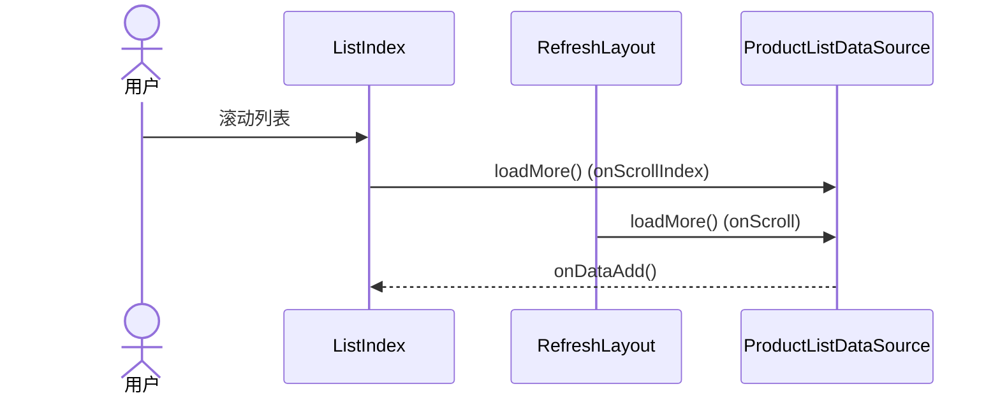
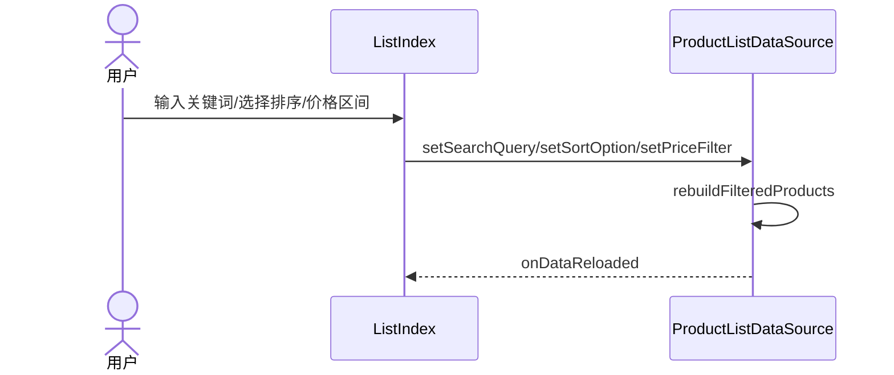

# 架构设计与模块说明

## 总体架构
- UI 层：`pages/` 负责页面入口与布局，`view/` 负责组件封装与交互。
- 数据层：`viewmodel/` 提供商品数据模型与分页逻辑（当前为本地模拟）。
- 资源层：`entry/src/main/resources` 存放图片、国际化字符串、颜色等资源。

## 模块划分（基于当前实现）
- `List_commodity/entry/src/main/ets/entryability/EntryAbility.ets`：应用生命周期与页面加载入口。
- `List_commodity/entry/src/main/ets/pages/ListIndex.ets`：主页面，负责 Tab 与列表组合。
- `List_commodity/entry/src/main/ets/view/RefreshLayout.ets`：下拉刷新与滚动触底检测。
- `List_commodity/entry/src/main/ets/view/GoodsListComponent.ets`：商品卡片 UI。
- `List_commodity/entry/src/main/ets/viewmodel/ListDataSource.ets`：商品数据结构、分页与模拟加载。
- `List_commodity/entry/src/main/ets/common/CommonConstants.ets`：样式常量。
- `List_commodity/entry/src/main/ets/view/TabBarsComponent.ets`、`PutDownRefreshLayout.ets`：旧版示例组件，当前未在 `ListIndex.ets` 中引用。

## 关键数据流
- Tab 切换：更新 `selectedTabIndex` -> 获取对应 `ProductListDataSource` -> 若为空则 `refresh()`。
- 下拉刷新：`RefreshLayout` 顶部下拉达到阈值 -> `dataSource.refresh()` -> 触发 `onDataReloaded()`。
- 懒加载：`ListIndex` 的 `onScrollIndex` 与 `RefreshLayout` 的 `onScroll` 监测滚动 -> `dataSource.loadMore()` -> `onDataAdd()`。
- 搜索/筛选：更新搜索词或筛选条件 -> `dataSource.setSearchQuery/setSortOption/setPriceFilter` -> 过滤并重载分页数据。

## UML 类图（核心对象）

## UML 时序图（下拉刷新）

## UML 时序图（懒加载）

## UML 时序图（搜索与筛选）

