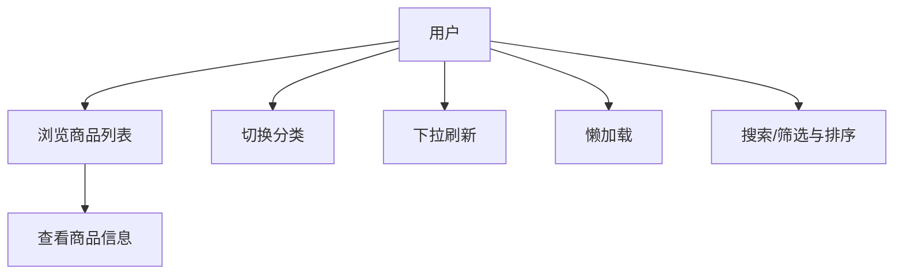

# 需求分析与功能实现

## 项目定位与范围
当前版本聚焦于“商城商品列表”页面，展示多分类商品并提供下拉刷新、懒加载和触底提示。数据为本地模拟数据，尚未接入网络接口，但已完成搜索、筛选与排序交互。

## 功能需求与当前实现
### 已实现
- 商品浏览：在 `List_commodity/entry/src/main/ets/pages/ListIndex.ets` 中使用 `List + LazyForEach` 渲染商品卡片，卡片样式在 `view/GoodsListComponent.ets`。
- 分类 Tab：五个分类（精选、手机、服饰、穿搭、家居），各自独立 `ProductListDataSource`。
- 下拉刷新：`view/RefreshLayout.ets` 监听顶部下拉，阈值约 80px 触发刷新，模拟 1.5s 网络延迟。
- 懒加载与触底提示：滚动到 80% 进度或接近尾部 6 条时加载更多；无更多数据时显示“已经到底了”。
- 空状态提示：数据为空时展示“哎呀，这里还没有商品哦”。
- 搜索与筛选：支持按名称/描述搜索，并提供价格区间筛选与排序（默认/价格升降/好评优先）。

### 未实现（需补充）
- 真实网络数据：当前仅为本地模拟数据源。
- 更丰富的筛选维度：如品牌、销量、评价数等多条件组合筛选。

## 非功能需求
- 运行环境：HarmonyOS 5.0.5+，DevEco Studio 6.0.0+（与 `List_commodity/README.md` 保持一致）。
- 性能目标：长列表滚动流畅，懒加载触发前置（距末尾约 6 条），目标帧率 ≥40fps（待量化测试）。
- 稳定性：刷新失败时重置刷新状态，避免卡死（`RefreshLayout.ets` 已做异常捕获）。

## 用例与验收
| 用例 | 触发方式 | 预期结果 | 当前状态 |
| --- | --- | --- | --- |
| 浏览商品列表 | 进入首页 | 展示商品卡片与价格评价 | 已实现 |
| 切换分类 | 点击 Tab | 切换列表并加载该分类数据 | 已实现 |
| 下拉刷新 | 列表顶部下拉 | 展示“正在刷新...”并重载数据 | 已实现 |
| 懒加载 | 滑动接近底部 | 自动加载下一批数据 | 已实现 |
| 触底提示 | 无更多数据 | 显示“已经到底了” | 已实现 |
| 搜索 | 输入关键词 | 列表过滤 | 已实现 |
| 筛选/排序 | 选择规则 | 列表重排 | 已实现 |

## UML 用例图（当前版本）

