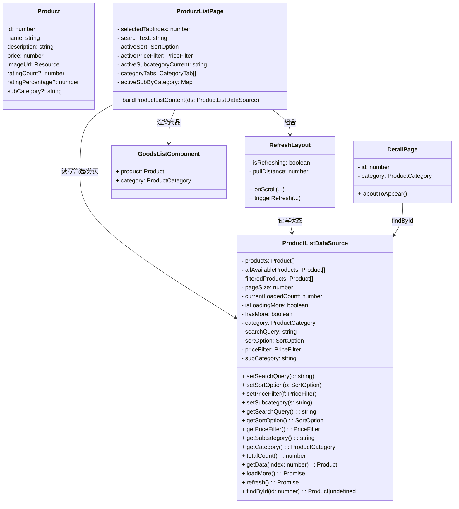

# 核心类图（抽象）

以下类图覆盖数据源、视图组件与页面间关系，体现职责分离与调用路径。

```mermaid
classDiagram
class ProductListDataSource {
  - products: Product[]
  - allAvailableProducts: Product[]
  - filteredProducts: Product[]
  - pageSize: number
  - currentLoadedCount: number
  - isLoadingMore: boolean
  - hasMore: boolean
  - category: ProductCategory
  - searchQuery: string
  - sortOption: SortOption
  - priceFilter: PriceFilter
  - subCategory: string
  + setSearchQuery(q: string)
  + setSortOption(o: SortOption)
  + setPriceFilter(f: PriceFilter)
  + setSubcategory(s: string)
  + getSearchQuery(): string
  + getSortOption(): SortOption
  + getPriceFilter(): PriceFilter
  + getSubcategory(): string
  + getCategory(): ProductCategory
  + totalCount(): number
  + getData(index: number): Product
  + loadMore(): Promise<void>
  + refresh(): Promise<void>
  + findById(id: number): Product|undefined
}

class Product {
  id: number
  name: string
  description: string
  price: number
  imageUrl: Resource
  ratingCount?: number
  ratingPercentage?: number
  subCategory?: string
}

class ProductListPage {
  - selectedTabIndex: number
  - searchText: string
  - activeSort: SortOption
  - activePriceFilter: PriceFilter
  - activeSubcategoryCurrent: string
  - categoryTabs: CategoryTab[]
  - activeSubByCategory: Map<ProductCategory, string>
  + buildProductListContent(ds: ProductListDataSource)
}

class RefreshLayout {
  - isRefreshing: boolean
  - pullDistance: number
  + onScroll(...)
  + triggerRefresh(...)
}

class GoodsListComponent {
  + product: Product
  + category: ProductCategory
}

class DetailPage {
  - id: number
  - category: ProductCategory
  + aboutToAppear()
}

ProductListPage --> ProductListDataSource : 读写筛选/分页
ProductListPage --> RefreshLayout : 组合
RefreshLayout --> ProductListDataSource : 读写状态
ProductListPage --> GoodsListComponent : 渲染商品
DetailPage --> ProductListDataSource : findById
```
