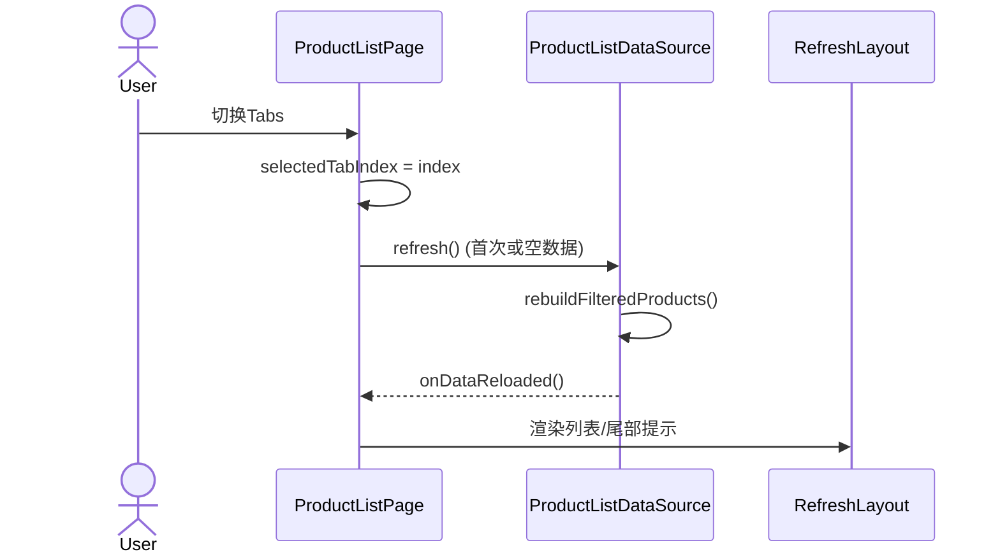
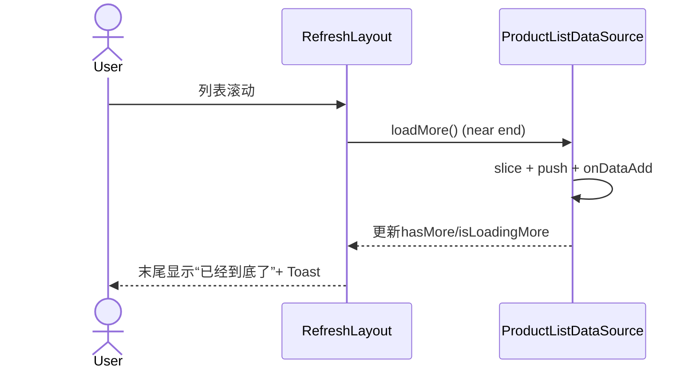
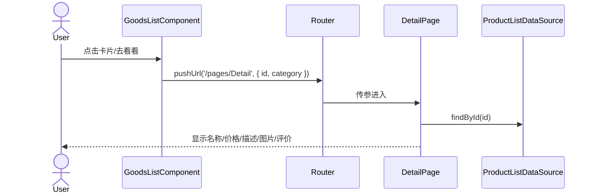

# 关键顺序图

## 切换分类与渲染

```mermaid
sequenceDiagram
actor User
participant Page as ProductListPage
participant DS as ProductListDataSource
participant RL as RefreshLayout

User->>Page: 切换Tabs
Page->>Page: selectedTabIndex = index
Page->>DS: refresh() (首次或空数据)
DS->>DS: rebuildFilteredProducts()
DS-->>Page: onDataReloaded()
Page->>RL: 渲染列表/尾部提示
```

## 懒加载与触底提示

```mermaid
sequenceDiagram
actor User
participant RL as RefreshLayout
participant DS as ProductListDataSource

User->>RL: 列表滚动
RL->>DS: loadMore() (near end)
DS->>DS: slice + push + onDataAdd
DS-->>RL: 更新hasMore/isLoadingMore
RL-->>User: 末尾显示“已经到底了”+ Toast
```

## 查看详情

```mermaid
sequenceDiagram
actor User
participant Item as GoodsListComponent
participant Router
participant Detail as DetailPage
participant DS as ProductListDataSource

User->>Item: 点击卡片/去看看
Item->>Router: pushUrl('/pages/Detail', { id, category })
Router->>Detail: 传参进入
Detail->>DS: findById(id)
Detail-->>User: 显示名称/价格/描述/图片/评价
```
