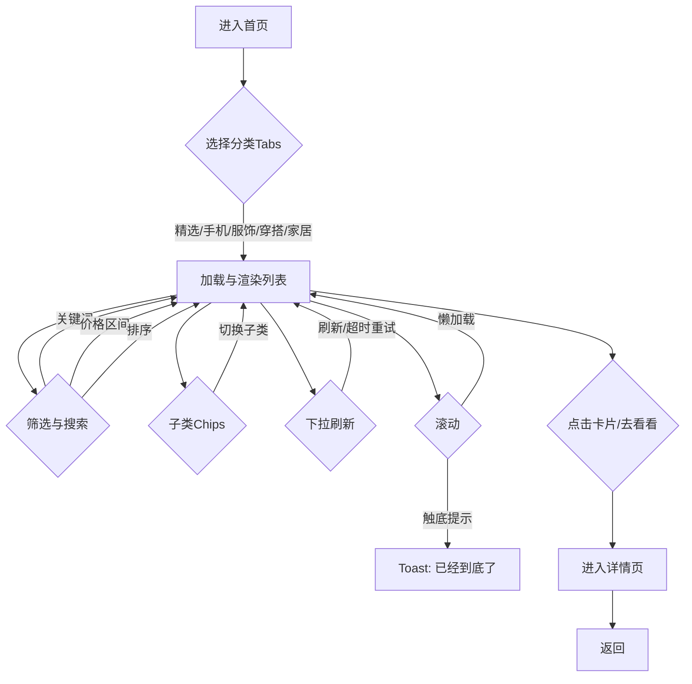

# 用例图与需求用例说明

本项目主要用户角色为“普通用户”。以下用例涵盖浏览、查找、筛选与详情查看等核心流程。

- 浏览商品列表：用户进入首页，按类别页签浏览商品；支持懒加载与触底提示。
- 搜索商品：用户在搜索框输入关键词，列表实时过滤并高亮匹配。
- 筛选排序：用户选择价格区间与排序方式（默认/价格↑/价格↓/好评优先）。
- 子类筛选：用户在各分类下选择子类 Chips（如“旗舰/续航/影像/入门”）。
- 下拉刷新：用户在顶部下拉刷新，展示状态提示与超时重试。
- 查看详情：用户点击商品卡或“去看看”跳转至详情页，查看名称、价格、描述、预览图与评价信息。
- 触底提示：列表滚动到底部时显示“已经到底了”并弹 Toast。

